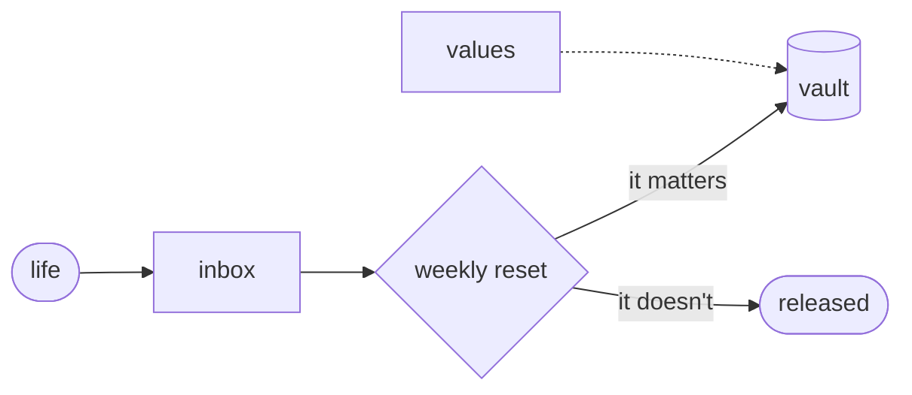

# tide

> *slack water: the still moment between tides. not empty — suspended.*
> *the water isn't going nowhere; it's deciding.*

More arrives each day than you can hold. Most systems for managing this ask you to commit — to a method, a tool, a subscription, a version of yourself that has it all organized. tide asks for almost nothing: a folder structure, a convention, plain text files.

if the tools change — and they will — your files don't.



two repositories — one public, one private — symlinked into a single vault your editor sees as one. one branch for the structure, one branch for your life. schema changes flow in one direction. your data never touches the template.

---

[philosophy](PHILOSOPHY.md) · [how it works](vault/00-system/SYSTEM.md) · [how to use it](vault/00-system/GUIDE.md) · [set it up](SETUP.md)

---

## fork it

```bash
# clone the repos
git clone https://github.com/your-handle/tide ~/code/tide
git clone https://github.com/your-handle/tide-private ~/code/tide-private

# create the vault and symlinks
mkdir ~/tide
ln -s ~/code/tide/vault ~/tide/public
ln -s ~/code/tide-private/vault ~/tide/private

# create your personal branch in each repo
cd ~/code/tide && git checkout -b personal && git push -u origin personal
cd ~/code/tide-private && git checkout -b personal && git push -u origin personal
```

open `~/tide` as your Obsidian vault. start with [`VALUES.md`](vault/00-system/VALUES.md).

---

## reference

| document | purpose |
|----------|---------|
| [`PHILOSOPHY.md`](PHILOSOPHY.md) | why the system is shaped the way it is |
| [`SETUP.md`](SETUP.md) | full bootstrap: layout, git, symlinks, gitignore |
| [`REPO-MANAGEMENT.md`](REPO-MANAGEMENT.md) | repo hygiene: PRs, branches, CI, changelog |
| [`vault/00-system/SYSTEM.md`](vault/00-system/SYSTEM.md) | full spec: schema, folder weights, cascade protocol, weekly ritual |
| [`vault/00-system/GUIDE.md`](vault/00-system/GUIDE.md) | day-to-day: capturing, inbox, projects, committing |
| [`vault/00-system/PRAXIS.md`](vault/00-system/PRAXIS.md) | how you operate: agency, decisions, known failure modes |
| [`vault/00-system/ANXIETIES.md`](vault/00-system/ANXIETIES.md) | anxiety tracker: structured challenge and resolution |
| [`vault/00-system/SCHEMA-CHANGELOG.md`](vault/00-system/SCHEMA-CHANGELOG.md) | schema version history; referenced when merging main → personal |

---

[CC BY 4.0](LICENSE)
